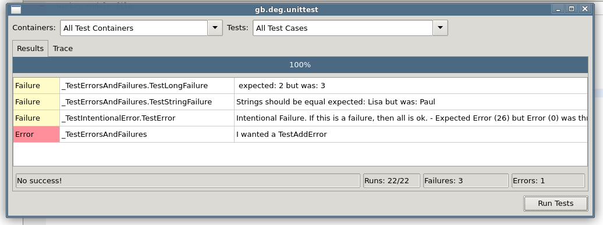
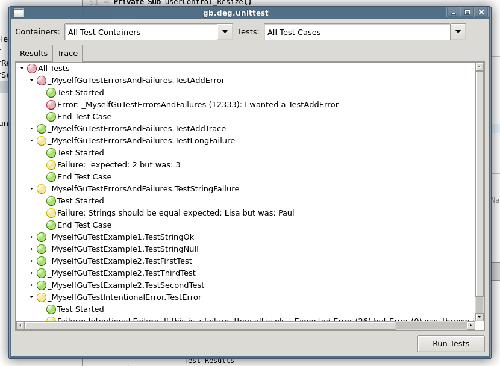
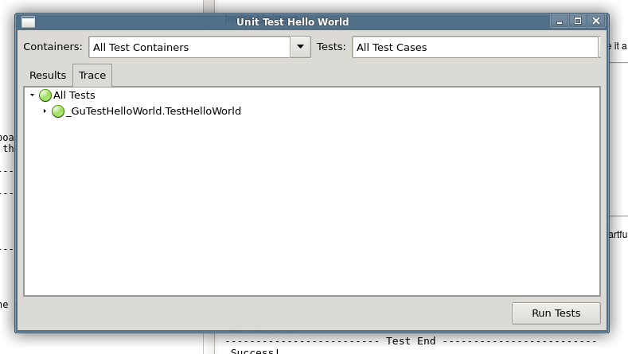

# gb.deg.unittest – A Gambas Unittest

A Gambas component for unittesting and test-driven programming. Forked and inspired from a quite old program: [COMUnit](http://comunit.sourceforge.net) and mainly JUnit. Currently beta state. With an unittest component one can develop software in a test-diven matter and is able to ensure that on refactoring the desired results of methods and classes stay the same.

Scroll down to understand, how it works.

## Runner

Here you can see the Unittest tests itself. The test classes have to produce some failures and one error, to prove, that all works ok. Usually the testclasses' names should start with "_GuTest" but for testing itself Unittest uses an alternate prefix ("_MyselfGuTest").

## Tracer

The Trace tab gives a fast overview:

## How it works

It is a component. To make it work, you have to generate an installation package for your distribution with Gambas3 (min. Version 3.8.) and install it on your Linux system. After that you can use it in all your projects as a component.

The following example you find also in [this simple Gambas project](unittesthelloworld-0.0.1.tar.gz).

### Example Test Class

You should create a exported class with a name starting with "_GuTest", for example "_GuTestHelloWorld", it contains one or more public testmethod(s):

----

    'Class _GuTestHelloWorld
    'Test HelloWorld
    
    Export
    Inherits ATestContainer
    
    Public Sub TestHelloWorld()
    
        Me.Result.AssertEqualsString("Hello World", Hello.World(), "Strings should be equal")
    
    End
----

### Module(Function) to test:

To make it work, a function "World" in a module "Hello" in your project must exist:

----

    ' Gambas module file
    
    Public Function World() As String
    
      Dim w As String
    
      w = "Hello World"
      Return w
    
    End
    
----

### Invite Unittest

The simple way to execute the Unittest is, to create another Module, name it Test and make it a a Gambas Startclass:

----

    'Module Test
    'Starts the Unittest
    
    Public Sub Main()
        
        Dim U as New Unittest
        
        U.Test
        
    
    End

----

If you did this all correctly and now Hit < F5 > on your keyboard, gambas will execute the  startfunction in module Test and presents the test result in the console:

    ----------------------- Test Results ----------------------- 
     1 Tests done
    ------------------------------------------------------------ 
     No Errors
    
    
     No Failures
    ------------------------- Test End -------------------------
     Success!
    
----

Sooo ... and if you want to see the beautiful form, change the startclass (ah... startmodule)

----
    Public Sub Main()
    
      Dim U As New Unittest
      
      'U.Test is now replaced by
      U.ShowTestForm
    
    End
----

If you hit now < F5 > you see the Testform where you can choose and run your tests. When done, have a look at the Trace Tab:

## Unittesting with gb.deg.unittest

Look around by positioning the cursor on "Unittest" and hit < F1 >. The relevant methods to test your code are in the class TestResult:

AddError AddFailure AddTrace Assert AssertEmpty AssertEqualsFloat AssertEqualsLong AssertEqualsObject AssertEqualsString AssertEqualsVariant AssertError AssertExists AssertFalse AssertNotEmpty AssertNotNull

Dig it out!

