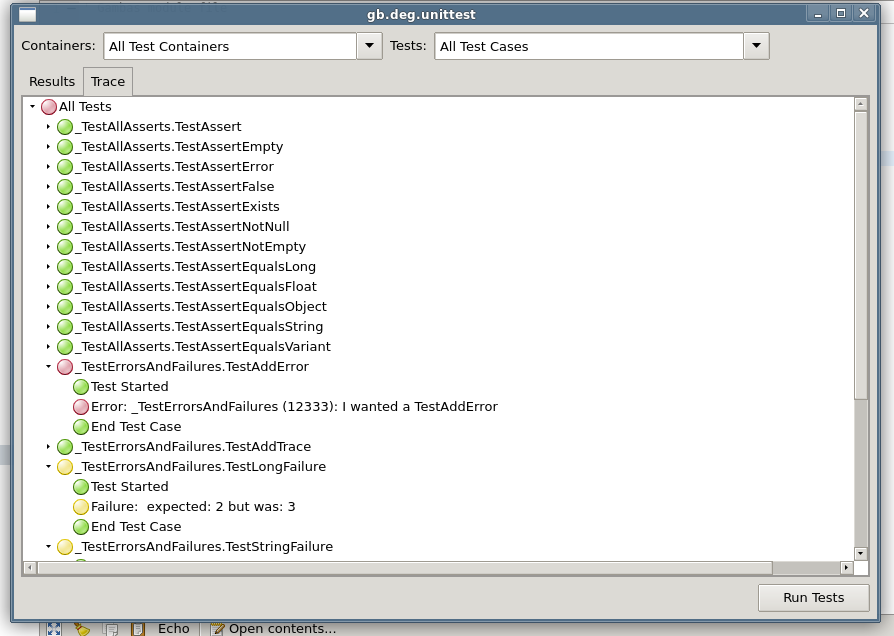

# gb.deg.unittest – A Gambas Unittest

A Gambas component for unittesting and test-driven programming. Forked and inspired from a quite old program: [COMUnit](http://comunit.sourceforge.net) and mainly JUnit. Currently beta state. With an unittest component one can develop software in a test-driven matter and is able to ensure that on refactoring the desired results of methods and classes stay the same.

Scroll down to understand, how it works.

## Runner

Here you can see the Unittest tests itself. The testclasses (here called TestContainer) have to produce some failures and one error, to prove, that all works ok.

## Tracer

The Trace tab gives a fast overview:

## How it works

It is a component. To make it work, you have to generate an installation package for your distribution with Gambas3 (it is prooved to work for Version 3.8. upwards) and install it on your Linux system. After that you can use it in all your projects as a component.

The following example you find also in [this simple Gambas project](unittesthelloworld-0.0.1.tar.gz).

### Example TestContainer

You should create a class with a name starting with "_Test", for example "_TestHelloWorld", it contains one or more public testmethod(s). It has to inherit from ATestContainer and it has to be exported to ensure the unittest will recognize it. It is the so called TestContainer:

----
    ' Gambas class file
    ''' TestContainer _TestHelloWorld
    
    Export
    Inherits ATestContainer
        
    Public Sub TestHelloWorld()
    
        Me.Result.AssertEqualsString("Hello World", Hello.World(), "Strings should be equal")
    
    End
----

### Module(Function) to test:

To make it work, we need a funktion to test. So we create a function "World" in a module "Hello" in our project:

----

    ' Gambas module file
    
    ''' Module is named "Hello"
    
    Public Function World() As String
    
      Dim w As String
    
      w = "Hello World"
      Return w
    
    End
    
----

### Invite Unittest

The simple way to execute the Unittest is, to create another Module, name it "Test" ore something more interesting and make it a Gambas Startclass:

----

    'Module Test
    'Starts the Unittest
    
    Public Sub Main()
        
        Dim U as New Unittest
        
        U.Test
        
    
    End

----

If you did this all correctly and now Hit < F5 > on your keyboard, gambas will execute the  startfunction in module Test, which works through the method(s) of our TestContainer and presents the test result in the console:

    ----------------------- Test Results ----------------------- 
     1 Tests done
    ------------------------------------------------------------ 
     No Errors
    
    
     No Failures
    ------------------------- Test End -------------------------
     Success!
    
----

Sooo ... and if you want to see the beautiful form, change the startclass (ah... startmodule)

----
    Public Sub Main()
    
      Dim U As New Unittest
      
      'U.Test is now replaced by
      U.ShowTestForm
    
    End
----

If you hit now < F5 > you see the Testform where you can choose and run your tests. When done, have a look at the Trace Tab:

## Unittesting with gb.deg.unittest

Look around by positioning the cursor on "Unittest" and hit < F1 >. The relevant methods to test your code are in the class TestResult:

AddError AddFailure AddTrace Assert AssertEmpty AssertEqualsFloat AssertEqualsLong AssertEqualsObject AssertEqualsString AssertEqualsVariant AssertError AssertExists AssertFalse AssertNotEmpty AssertNotNull

Dig it out!

## Test fixture

Sometimes it is neccessary to create a "fixture", a special environment for a test or a couple of tests, and to destroy that environment after the test is done. For example a database connection shall be established, some tables for testing should be created and all this has to be reverted afterwards. This can be done with Setup... and Teardown... functions inside the TestContainer.

### Sub SetupEach() and Sub TeardownEach()

You can create methods with these names to create an environment for each testmethod before is is invoked and to destroy it after. If you have five testmethods inside your TestContainer these functions will be invoked five times, SetupEach() before each testmethod, TeardownEach() after each testmethod. Got it?

### Sub SetupContainer() and Sub TeardownContainer()

You can create methods with these names to create an environment for all testmethods inside a TestContainer, at start SetupContainer() is invoked and after all testmethods inside the testclass are done you can destroy the environment with TeardownContainer().

